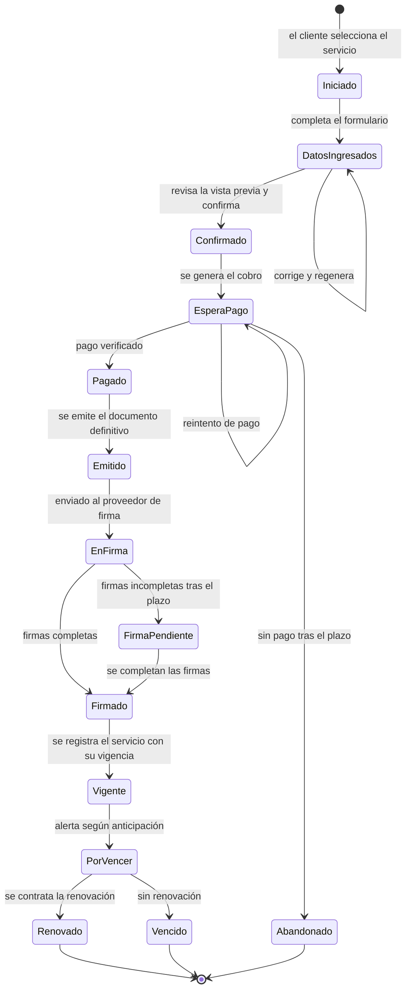

# Ficha funcional del servicio piloto

| | |
|---|---|
| **Cliente** | Easy Office |
| **Proyecto** | CRM Easy Office · Plataforma de gestión y automatización documental |
| **Documento** | FUN-001 · Ficha funcional del servicio piloto |
| **Versión** | 1.0 |
| **Fecha** | 24 de septiembre de 2026 |
| **Servicio** | Domicilio tributario |
| **Estado** | Borrador para validación. **Ninguna decisión de este documento está confirmada por Easy Office.** |
| **Preparado por** | Fernando Cartagena · Nicolás Zapata · Marcos Álvarez |

---

## Por qué existe este documento

El §15 de las especificaciones recomienda diseñar y validar el flujo completo de
un servicio piloto antes de desarrollar el resto, y propone el domicilio
tributario. Este documento es ese diseño.

Existe además por una razón defensiva: hoy los documentos del proyecto describen
el piloto de tres formas distintas.

| Fuente | Qué dice |
|---|---|
| Levantamiento | Contrato por arriendo o cesión del espacio, más una autorización estandarizada. Firma el titular de la oficina |
| Especificaciones §6 | Contrato de domicilio tributario con nombre, RUT, dirección, comuna, servicio contratado y fecha |
| Prototipo | Declaración de cambio de domicilio tributario, firmada por el representante de la empresa |

No son el mismo proceso. Hasta que Easy Office confirme cuál es, el piloto no se
puede implementar sin riesgo de rehacerlo.

---

## 1. El servicio

| Elemento | Propuesta | Estado |
|---|---|---|
| Nombre comercial | Domicilio tributario | Confirmado |
| Qué se vende | El derecho a usar una oficina de Easy Office como domicilio tributario de la empresa del cliente, por un período determinado | `[VALIDAR]` |
| Duración | 12 meses | `[VALIDAR]` |
| Precio | Fijo por tipo de oficina | `[VALIDAR: es fijo o varía por cliente]` |
| Renovable | Sí | `[VALIDAR]` |
| Modalidad | Automatizado, sin intervención de ejecutivo | Confirmado |

---

## 2. La oficina contratada

**Propuesta del equipo, pendiente de validación.**

El prototipo actual pide al cliente escribir la dirección y el rol de avalúo. Eso
no tiene sentido si lo que contrata es una oficina de Easy Office: la empresa
conoce esos datos y el cliente no.

Propuesta: el cliente **selecciona una oficina disponible** de un catálogo
administrado por Easy Office. La dirección, la comuna y el rol de avalúo se
obtienen de ese catálogo y se insertan en el documento.

| Pregunta | Estado |
|---|---|
| ¿El cliente elige la oficina o Easy Office se la asigna? | `[VALIDAR]` |
| ¿Hay límite de empresas domiciliadas por oficina? | `[VALIDAR]` |
| ¿El precio depende de la oficina? | `[VALIDAR]` |
| ¿Hay oficinas en las tres regiones disponibles para autoservicio? | `[VALIDAR]` |

---

## 3. Documentos que se generan

**Esta es la decisión más importante del documento y la que está menos resuelta.**

| Opción | Documentos | Implicancia |
|---|---|---|
| A | Un contrato de servicio | El más simple. Contradice el levantamiento, que menciona dos documentos |
| B | Contrato de servicio + autorización de domicilio ante el SII | Coincide con el levantamiento. Implica dos documentos por trámite y posiblemente firmantes distintos |
| C | Declaración de cambio de domicilio | Lo que muestra el prototipo. No coincide con ninguna otra fuente |

**Recomendación del equipo: opción B**, porque es la única respaldada por lo que
la contraparte declaró en el levantamiento. `[VALIDAR]`

Si se confirma B, el modelo de datos ya lo soporta: `TRAMITE` admite más de un
`DOCUMENTO` desde la versión corregida de `MOD-001`.

---

## 4. Firmantes

| Documento | Firmante propuesto | Fundamento | Estado |
|---|---|---|---|
| Contrato de servicio | Titular de la oficina, por Easy Office · Representante legal de la empresa cliente | Es un contrato entre dos partes | `[VALIDAR]` |
| Autorización de domicilio | Titular de la oficina | El levantamiento indica que firma el dueño de la oficina | `[VALIDAR]` |

**Discrepancia registrada.** El prototipo muestra al representante de la empresa
cliente como único firmante pendiente, con Easy Office ya firmado. El
levantamiento dice que firma el titular de la oficina. Ver `RN-001 v2` RN-23.

Preguntas abiertas: ¿el cliente firma, o basta con que Easy Office firme? ¿Se usa
la modalidad de firma desasistida y para cuál de los dos documentos? ¿En qué
orden firman?

---

## 5. Momento del pago

Hay una discrepancia de secuencia entre documentos:

| Fuente | Secuencia |
|---|---|
| Especificaciones §5.1 y §8.1 | Ingresar datos → **pagar** → generar documento → firmar |
| `ARQ-001`, `UML-001` y prototipo | Ingresar datos → **generar borrador** → confirmar → pagar → firmar |

Ambas son defendibles. La segunda es mejor experiencia: el cliente ve qué está
comprando antes de pagar. Pero requiere una distinción que hoy no está escrita en
ninguna parte.

**Propuesta: distinguir vista previa de emisión.**

- **Vista previa.** Documento provisorio, marcado visiblemente como borrador sin
  validez, generado antes del pago. No se almacena como documento emitido, no
  lleva folio y no se envía a firma.
- **Emisión.** Documento definitivo, generado después de confirmado el pago.
  Lleva folio, queda asociado al trámite, se le calcula el hash y se envía a
  firma.

Con esa distinción, ambas secuencias son compatibles: se genera una vista previa
antes del pago y se emite el documento después. `[VALIDAR CON EASY OFFICE]`

---

## 6. Vigencia y renovación

| Elemento | Propuesta | Estado |
|---|---|---|
| Inicio de vigencia | Fecha de emisión del documento firmado | `[VALIDAR]` |
| Término | Inicio más la duración del servicio | `[VALIDAR]` |
| Alertas | 60, 30, 15 y 7 días antes del término | Confirmado, ESP §4.8 |
| Renovación | Genera un servicio contratado nuevo y conserva el anterior | `[VALIDAR]` |
| ¿La renovación emite documentos nuevos? | Sí, los mismos del contrato original | `[VALIDAR]` |
| ¿La renovación es autoservicio o la gestiona un ejecutivo? | `[VALIDAR]` | — |

---

## 7. Excepciones

Ninguna está definida. Todas requieren decisión de Easy Office.

| Situación | Pregunta | Propuesta preliminar |
|---|---|---|
| El cliente detecta un error en la vista previa | ¿Puede corregir y regenerar? ¿Cuántas veces? | Sí, sin límite antes del pago |
| El cliente abandona el flujo antes de pagar | ¿Qué pasa con el trámite y con los datos ingresados? | El trámite queda en estado *Abandonado* tras un plazo; los datos del cliente se conservan |
| El pago falla | ¿Se puede reintentar? ¿Cuántas veces? | Sí, el trámite queda en espera de pago |
| El cliente pide un cambio después de pagar y antes de firmar | ¿Se anula y se reemite? ¿Se devuelve el pago? | `[SIN PROPUESTA — requiere decisión de la empresa]` |
| El cliente pide anular después de firmado | ¿Procede? ¿Con qué condiciones? | `[SIN PROPUESTA]` |
| La firma no se completa | ¿Hay plazo? ¿Qué se hace? | El trámite queda en firma pendiente y se notifica internamente |
| La oficina elegida ya no tiene cupo | ¿Se bloquea antes de pagar? | Sí, la validación ocurre antes del pago |
| El RUT ya tiene un domicilio tributario vigente con Easy Office | ¿Se permite otro? ¿Se ofrece renovar? | `[SIN PROPUESTA]` |

---

## 8. Flujo propuesto

Los estados de este diagrama son una **propuesta**. Poblarán
`ESTADO_TRAMITE` y `TRANSICION_ESTADO` una vez validados.

---

## 9. Qué hay que preguntar para cerrar esta ficha

En orden de impacto. Las cuatro primeras bloquean la implementación.

1. **¿Qué documentos se emiten exactamente y quién firma cada uno?** Opción A, B
   o C de la sección 3, con sus firmantes.
2. **¿El cliente selecciona la oficina o se la asignan?** Determina el formulario
   y el modelo de datos.
3. **¿El pago va antes o después de la vista previa?** Y si aceptan la distinción
   entre vista previa y emisión.
4. **¿Cuál es la duración del servicio y cómo funciona la renovación?**
5. ¿Hay límite de empresas por oficina?
6. ¿Qué ocurre si el cliente pide cambios o anulación después de pagar?
7. ¿El precio es fijo o depende de la oficina?
8. ¿La firma desasistida aplica a alguno de estos documentos?

---

## Trazabilidad

| Elemento | Referencias |
|---|---|
| Requerimientos | RF-19 a RF-32 |
| Historias | HU-23 a HU-29, HU-54 a HU-57 |
| Casos de uso | UC-01, UC-15, UC-16, UC-17 |
| Reglas de negocio | RN-13, RN-18, RN-21 a RN-28 |
| Riesgos asociados | R-02 plantillas, R-10 fidelidad de formato, R-11 firma desasistida |

---

## Historial de versiones

| Versión | Fecha | Cambios |
|---|---|---|
| 1.0 | 24-09-2026 | Versión inicial. Registra las tres descripciones divergentes del piloto y propone una definición única para validación |
