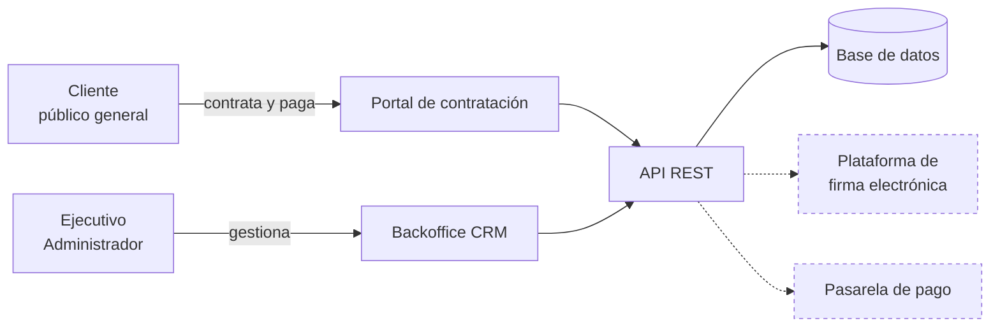
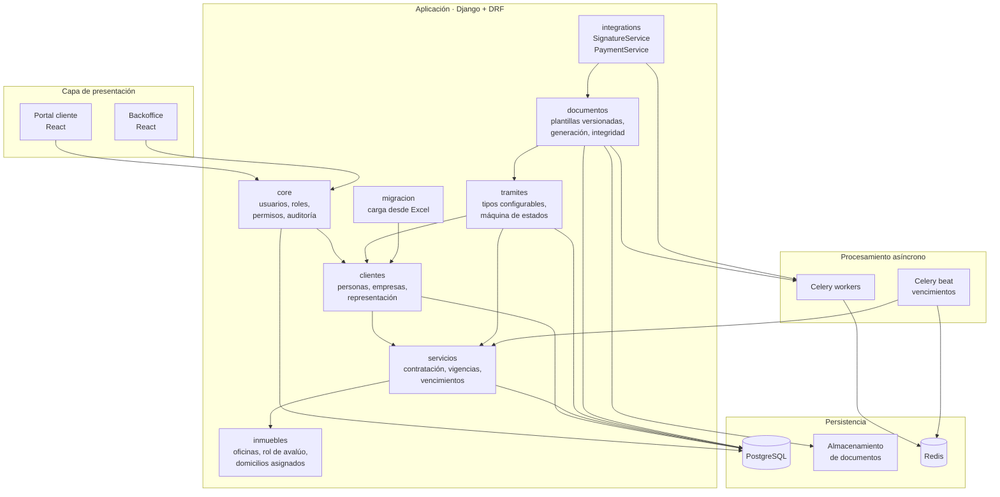
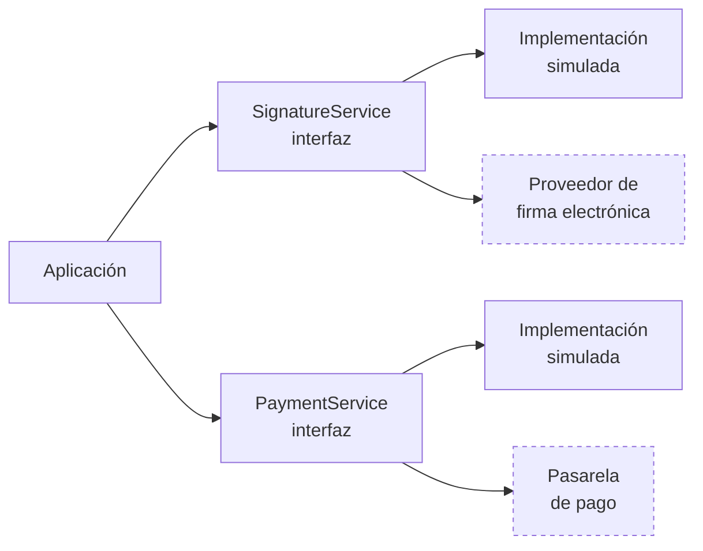
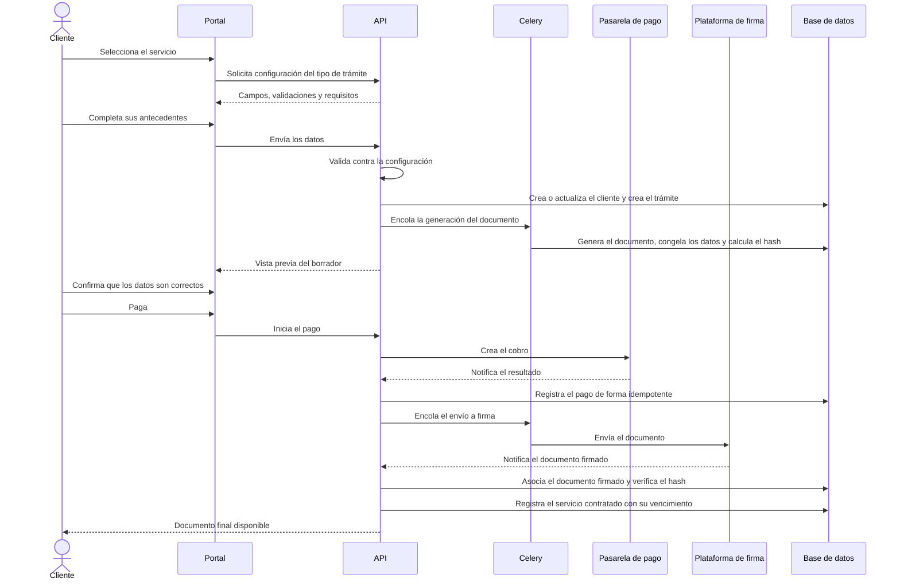
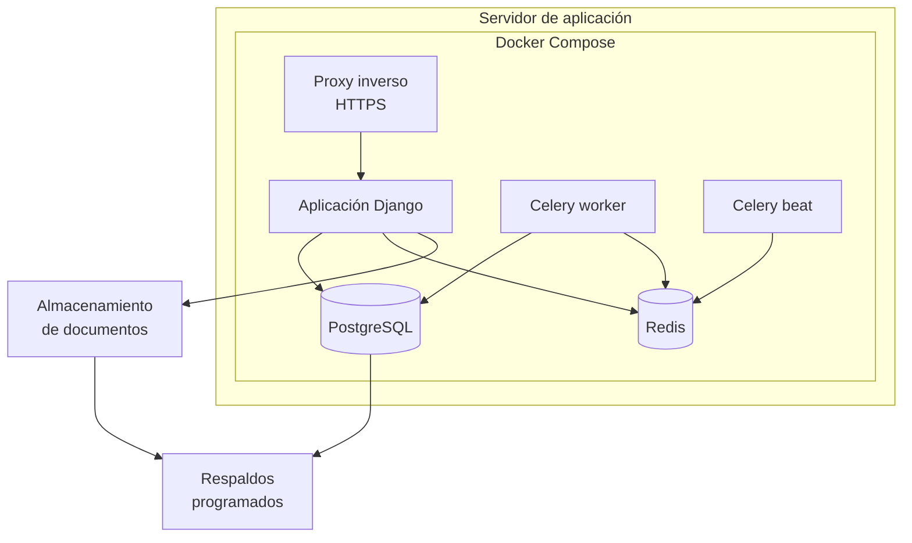

# Arquitectura de la solución

| | |
|---|---|
| **Cliente** | Easy Office |
| **Proyecto** | CRM Easy Office · Plataforma de gestión y automatización documental |
| **Documento** | ARQ-001 · Arquitectura de la solución |
| **Versión** | 1.0 |
| **Fecha** | 24 de septiembre de 2026 |
| **Estado** | Propuesta de arquitectura. Sujeta a ajustes al recibir la documentación técnica de la plataforma de firma electrónica |
| **Preparado por** | Fernando Cartagena · Nicolás Zapata · Marcos Álvarez |

---

## 1. Contexto

Easy Office solicita una plataforma compuesta por dos áreas: un CRM interno para
dueños, administradores y ejecutivos, y una web con contratación en línea para
clientes. Ambas comparten la misma información: uno de los requisitos centrales
del encargo es que los datos ingresados por el cliente no se vuelvan a digitar
internamente.

Esa condición determina la primera decisión de arquitectura: **un solo dominio y
una sola base de datos**, con dos interfaces sobre él. No son dos sistemas que se
sincronizan; son dos puertas al mismo sistema.

Las líneas punteadas son servicios de terceros. El sistema no depende de su
disponibilidad para operar internamente.

---

## 2. Estilo arquitectónico

**Monolito modular.** Una aplicación, una base de datos, un despliegue. Por
dentro, módulos con responsabilidades y fronteras explícitas.

**Por qué no microservicios.** Para un equipo de tres personas, un horizonte de
construcción de cinco sprints y un único producto, una arquitectura distribuida agrega complejidad de despliegue,
comunicación entre servicios, observabilidad y mantenimiento que no está
justificada por los requerimientos. El volumen declarado por la contraparte es de
200 a 250 clientes mensuales con una meta de 50 operaciones diarias: no hay
componente que necesite escalar de forma independiente.

Easy Office pidió expresamente (§11) una solución que permita incorporar nuevos
servicios, documentos, roles, sucursales, formas de pago y plataformas de firma.
Esa escalabilidad es **funcional**, no de infraestructura, y se resuelve con
configuración y con módulos bien delimitados, no con despliegues separados.

La modularidad interna deja abierta la posibilidad de extraer un módulo a un
servicio propio más adelante, si alguna vez hiciera falta. El camino inverso, de
microservicios a monolito, es mucho más costoso.

---

## 3. Vista de componentes

### Responsabilidad de cada módulo

| Módulo | Responsabilidad | Puede depender de |
|---|---|---|
| `core` | Usuarios, roles, permisos, registro de auditoría | Nada |
| `clientes` | Personas, empresas, representación legal, ficha del cliente | `core` |
| `servicios` | Servicios contratados, precios, vigencias, alertas de vencimiento | `core`, `clientes` |
| `inmuebles` | Oficinas, rol de avalúo, asignación de domicilios | `core`, `servicios` |
| `tramites` | Tipos de trámite configurables, trámites, máquina de estados | `core`, `clientes`, `servicios` |
| `documentos` | Plantillas versionadas, generación, firmantes, integridad | `core`, `tramites` |
| `integrations` | Interfaces e implementaciones de firma y pago | `core` |
| `migracion` | Carga de la información desde Excel | `clientes`, `servicios` |

**Regla de dependencia.** Los módulos se comunican mediante funciones de servicio
públicas, no consultando directamente los modelos de otro módulo. La dirección de
dependencia es estrictamente descendente en la tabla: `documentos` puede depender
de `tramites`, pero `tramites` nunca de `documentos`.

---

## 4. Comunicación entre componentes

### 4.1 Frontend ↔ Backend

API REST sobre HTTPS. Autenticación por **sesión con cookies httpOnly**, no
tokens en almacenamiento del navegador: el sistema maneja datos personales de
clientes reales y una cookie httpOnly no es legible por scripts de la página.

Los dos frontends consumen la misma API. Las diferencias de acceso se resuelven
por permisos del rol, no por endpoints separados.

### 4.2 Procesamiento asíncrono

La generación de documentos y las llamadas a servicios externos no ocurren dentro
del ciclo de una petición HTTP. Se encolan en Celery sobre Redis.

Motivos: generar un documento puede tomar segundos, una llamada a un proveedor
externo puede fallar o demorar, y ambos casos dejarían al usuario esperando o
con un error que no le corresponde.

Celery beat ejecuta además la revisión programada de vencimientos, que alimenta
las alertas configurables de 60, 30, 15 y 7 días que pide el §4.8 del encargo.

### 4.3 Integraciones externas

La aplicación nunca invoca directamente el SDK de un proveedor. Habla con una
interfaz definida por el equipo, y la implementación concreta se selecciona por
configuración del entorno.

Esto responde a dos condiciones del encargo. El §7 subordina la integración de
firma a las capacidades técnicas y la API disponibles, que todavía no están
confirmadas. El §5.3 deja la elección de la pasarela de pago a la recomendación
del equipo, decisión que la empresa aún no toma. Con las interfaces, ninguna de
las dos indefiniciones bloquea el desarrollo.

Los eventos entrantes de ambos proveedores, las notificaciones de resultado de
pago y de firma, se procesan de forma **idempotente**: cada operación externa
lleva un identificador único y se registra un log de eventos recibidos, porque
las notificaciones llegan duplicadas y fuera de orden.

---

## 5. Flujo del servicio piloto

Secuencia del domicilio tributario, que Easy Office define como servicio piloto
en el §15.

El último paso es el que conecta el portal con el CRM sin redigitación, que el
§9 identifica como uno de los requisitos centrales del encargo. A partir de ahí
el servicio queda bajo seguimiento y genera sus alertas de vencimiento.

---

## 6. Despliegue

Toda la configuración se inyecta por variables de entorno. Ninguna credencial
vive en el código ni en el repositorio, que es público.

Los documentos emitidos se almacenan fuera del sistema de archivos efímero del
contenedor. Un volumen de Docker sí persiste entre despliegues, de modo que ese
no es el motivo. Las razones son otras tres: poder respaldar los documentos con
una política distinta a la de la base de datos, poder migrar el sistema a otro
servidor sin arrastrar el almacenamiento, y poder servirlos sin pasar por la
aplicación si el volumen lo justificara. Un volumen dedicado cumple estas
condiciones en la etapa actual; un almacenamiento de objetos compatible con S3 es
la evolución natural si crece el volumen.

El proveedor de alojamiento está `[PENDIENTE DE DEFINIR CON EASY OFFICE]`. Al
estar contenerizado, el despliegue es portable entre proveedores, que es lo que
permite tomar esa decisión más adelante sin rehacer trabajo.

---

## 7. Atributos de calidad y cómo se sostienen

| Atributo | Cómo se aborda | Origen |
|---|---|---|
| Seguridad | Autenticación individual, permisos por rol, secretos en variables de entorno, HTTPS, datos anonimizados en desarrollo | §4.3 del encargo |
| Trazabilidad | Registro de auditoría append-only con usuario, fecha, registro, acción, valor anterior y nuevo | §4.3 |
| Escalabilidad funcional | Servicios, documentos, roles y flujos definidos por configuración, no por código | §11 |
| Escalabilidad de datos | Base relacional con índices sobre los criterios de búsqueda declarados: RUT, razón social, teléfono, correo, folio, servicio | §4.1, §4.5 |
| Disponibilidad | Respaldos periódicos programados de base de datos y documentos | §4.3 |
| Portabilidad | Todo el entorno contenerizado y reproducible con docker-compose | Decisión del equipo: entorno reproducible y portable a cualquier proveedor de alojamiento |
| Mantenibilidad | Módulos con fronteras explícitas, interfaces para dependencias externas | §10 |
| Integridad documental | Hash SHA-256 antes y después de la firma, plantillas versionadas, datos congelados por documento | Decisión del equipo |

---

## 8. Decisiones registradas

| # | Decisión | Alternativa descartada | Motivo |
|---|---|---|---|
| AD-01 | Monolito modular | Microservicios | Equipo de tres, cinco sprints de construcción, un producto, sin necesidad de escalado independiente |
| AD-02 | Una sola base de datos para CRM y portal | Bases separadas con sincronización | El encargo exige que no haya redigitación; sincronizar introduce el problema que se busca eliminar |
| AD-03 | Sesión con cookies httpOnly | JWT en almacenamiento del navegador | Datos personales de clientes reales; el almacenamiento del navegador es legible por scripts |
| AD-04 | Interfaces para firma y pago | Llamadas directas al proveedor | La API de firma no está confirmada y el proveedor de pago no está decidido |
| AD-05 | Generación documental y llamadas externas en cola asíncrona | Dentro del ciclo de petición | Latencia y fallas de terceros no deben afectar al usuario |
| AD-06 | Tipos de trámite y servicios definidos por configuración | Desarrollo por cada documento | Lo exigen los §5.2, §8.2, §8.3 y §11 del encargo |
| AD-07 | Almacenamiento de documentos fuera del contenedor | Volumen local del contenedor | Persistencia entre despliegues y respaldo independiente |

---

## 9. Pendientes

- Documentación técnica y API de la plataforma de firma electrónica
  `[PENDIENTE — Easy Office, §14]`
- Decisión de la pasarela de pago `[PENDIENTE — Easy Office, §5.3]`
- Proveedor de alojamiento `[PENDIENTE]`
- Formato de las plantillas de contratos, que determina la tecnología de
  generación documental `[PENDIENTE — Easy Office, §14]`
