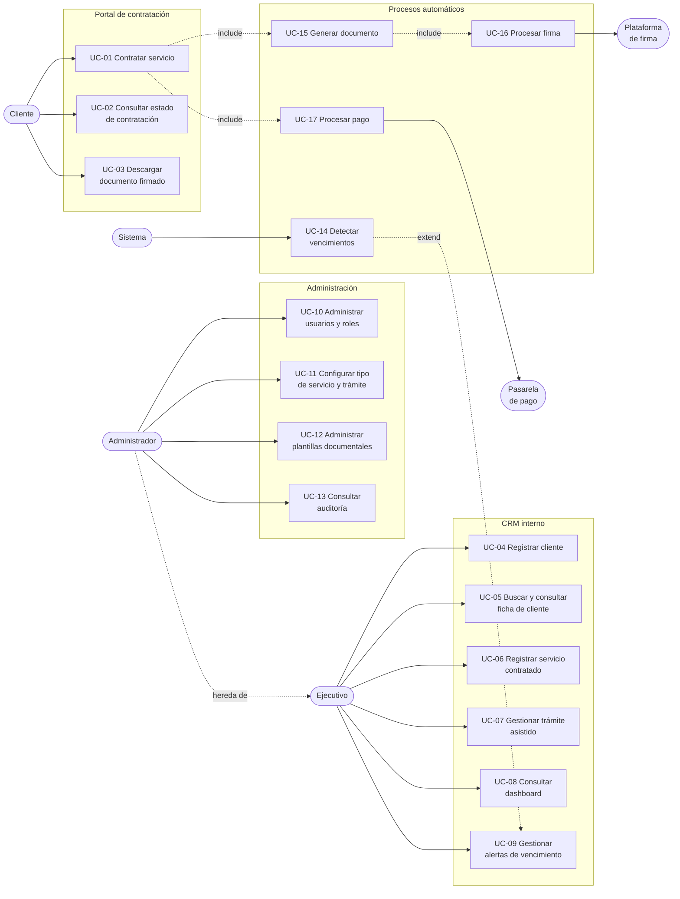

# Casos de uso

| | |
|---|---|
| **Cliente** | Easy Office |
| **Proyecto** | CRM Easy Office · Plataforma de gestión y automatización documental |
| **Documento** | UML-001 · Casos de uso |
| **Versión** | 1.0 |
| **Fecha** | 24 de septiembre de 2026 |
| **Estado** | Preliminar. Se ajusta con la confirmación de roles y estados |
| **Preparado por** | Fernando Cartagena · Nicolás Zapata · Marcos Álvarez |

---

## 1. Actores

| Actor | Descripción | Origen |
|---|---|---|
| **Cliente** | Emprendedor o empresa que contrata servicios. Opera desde el portal en línea | ESP §3, §5 |
| **Ejecutivo** | Personal de Easy Office que atiende clientes y gestiona servicios. Sin facultad de eliminar registros | ESP §4.2 |
| **Administrador** | Dueño o administrador. Acceso completo, administra usuarios, permisos y configuración, consulta auditoría | ESP §4.2 |
| **Sistema** | Actor no humano. Ejecuta procesos programados: detección de vencimientos y generación de alertas | ESP §4.8 |
| **Plataforma de firma** | Servicio externo de firma electrónica avanzada | ESP §7 |
| **Pasarela de pago** | Servicio externo de cobro en línea | ESP §5.3 |

El Administrador hereda todos los casos de uso del Ejecutivo y agrega los propios.

---

## 2. Diagrama de casos de uso

---

## 3. Especificación de los casos de uso principales

### UC-01 · Contratar servicio en línea

| | |
|---|---|
| **Actor principal** | Cliente |
| **Actores secundarios** | Pasarela de pago, plataforma de firma |
| **Objetivo** | Contratar un servicio y obtener el documento firmado sin intervención de un ejecutivo |
| **Precondición** | El tipo de servicio está configurado y activo |
| **Postcondición** | El cliente y el servicio contratado quedan registrados en el CRM, con el documento firmado asociado y el seguimiento de vencimiento iniciado |
| **Origen** | ESP §5.1, §9, §12 |

**Flujo principal**

1. El cliente selecciona un servicio del catálogo.
2. El sistema construye el formulario a partir de la configuración del tipo de trámite.
3. El cliente ingresa sus antecedentes.
4. El sistema valida los datos contra las reglas configuradas.
5. El sistema crea o actualiza el registro del cliente y crea el trámite.
6. El sistema genera el documento a partir de la plantilla vigente *(incluye UC-15)*.
7. El cliente revisa el borrador y confirma que los datos son correctos.
8. El cliente realiza el pago *(incluye UC-17)*.
9. El sistema verifica el resultado del pago.
10. El sistema envía el documento a firma *(incluye UC-16)*.
11. El sistema asocia el documento firmado al cliente y a la operación.
12. El sistema registra el servicio contratado con su fecha de inicio y vencimiento.
13. El cliente obtiene el documento final.

**Flujos alternativos**

- **4a.** Los datos no pasan la validación: el sistema indica qué corregir y no
  genera el documento.
- **7a.** El cliente detecta un error en el borrador: vuelve al paso 3 y el
  documento se regenera.
- **9a.** El pago falla o no se confirma: el trámite queda en espera de pago y no
  avanza a firma.
- **10a.** La plataforma de firma no responde: el envío se reintenta de forma
  asíncrona y el trámite permanece en estado de firma pendiente.

**Reglas aplicables:** RN-07 (no avanza a firma sin confirmación del cliente),
RN-10 (no se genera con campos obligatorios faltantes), RN-15 (puede requerir
varios firmantes).

---

### UC-04 · Registrar cliente

| | |
|---|---|
| **Actor principal** | Ejecutivo |
| **Objetivo** | Incorporar un cliente a la base de datos centralizada |
| **Precondición** | El ejecutivo está autenticado y su rol tiene la facultad de crear clientes |
| **Postcondición** | El cliente queda registrado con identificador único y la acción queda en auditoría |
| **Origen** | ESP §4.4, §4.5 |

**Flujo principal**

1. El ejecutivo abre el formulario de ingreso.
2. Ingresa datos del cliente, contacto, antecedentes personales o empresariales,
   datos tributarios, servicios, características, fechas y observaciones.
3. Ejecuta la acción de guardar.
4. El sistema valida campos obligatorios, formatos y posibles duplicidades.
5. El sistema asigna el identificador único y guarda el registro.
6. El sistema registra la acción en auditoría.

**Flujos alternativos**

- **4a.** El sistema detecta un cliente existente con el mismo RUT: advierte y
  ofrece abrir la ficha existente en lugar de duplicar.
- **4b.** Faltan campos obligatorios o hay formatos inválidos: el sistema indica
  cuáles y no guarda.

---

### UC-09 · Gestionar alertas de vencimiento

| | |
|---|---|
| **Actor principal** | Ejecutivo |
| **Actor secundario** | Sistema (UC-14) |
| **Objetivo** | Gestionar oportunamente la renovación de un servicio próximo a vencer |
| **Precondición** | Existen servicios contratados con fecha de término |
| **Postcondición** | La alerta queda marcada como gestionada |
| **Origen** | ESP §4.8 |

**Flujo principal**

1. El sistema detecta servicios próximos a vencer según la anticipación
   configurada *(UC-14)*.
2. El sistema genera las alertas internas correspondientes.
3. El ejecutivo consulta el listado de alertas.
4. El ejecutivo contacta al cliente y gestiona la renovación.
5. El ejecutivo marca la alerta como gestionada, o la renovación crea un servicio
   contratado nuevo.

**Nota.** La anticipación es configurable. Los valores iniciales declarados por la
contraparte son 60, 30, 15 y 7 días.

---

### UC-11 · Configurar tipo de servicio y trámite

| | |
|---|---|
| **Actor principal** | Administrador |
| **Objetivo** | Incorporar un servicio o documento nuevo sin desarrollo específico |
| **Precondición** | Existe una plantilla documental cargada para el documento asociado |
| **Postcondición** | El nuevo tipo queda disponible en el catálogo y operable de extremo a extremo |
| **Origen** | ESP §5.2, §8.2, §8.3, §11 |

**Flujo principal**

1. El administrador crea un tipo de servicio con su nombre, precio base y
   duración.
2. Define los campos del formulario y sus reglas de validación.
3. Asocia la plantilla documental y su versión vigente.
4. Indica si el trámite requiere pago y si requiere firma.
5. Define los estados y las transiciones válidas.
6. Activa el tipo de servicio.
7. El sistema lo incorpora al catálogo del portal.

**Nota.** Este caso de uso es el que materializa el requisito de escalabilidad del
§11. Su existencia es la diferencia entre un sistema que crece por configuración
y uno que crece por desarrollo.

---

### UC-13 · Consultar auditoría

| | |
|---|---|
| **Actor principal** | Administrador |
| **Objetivo** | Conocer qué usuario realizó qué acción sobre un registro |
| **Precondición** | El usuario tiene el rol con facultad de consultar auditoría |
| **Postcondición** | Ninguna. La consulta no altera el registro |
| **Origen** | ESP §4.2, §4.3 |

**Flujo principal**

1. El administrador selecciona un registro o un rango de fechas.
2. El sistema presenta los eventos con usuario, fecha y hora, registro afectado,
   acción y, cuando corresponde, valor anterior y valor nuevo.

**Restricción.** El historial es de solo lectura para todos los perfiles. No
existe caso de uso de modificación ni eliminación de auditoría, por diseño.

---

## 4. Trazabilidad hacia los requerimientos

| Caso de uso | Requerimientos |
|---|---|
| UC-01 Contratar servicio | RF-19 a RF-26, RF-28 a RF-32 |
| UC-02 Consultar estado | RF-27 |
| UC-03 Descargar documento | RF-26 |
| UC-04 Registrar cliente | RF-05, RF-06, RF-07 |
| UC-05 Buscar y consultar ficha | RF-08, RF-09, RF-10 |
| UC-06 Registrar servicio contratado | RF-11 |
| UC-07 Gestionar trámite asistido | RF-18 |
| UC-08 Consultar dashboard | RF-14 |
| UC-09 Gestionar alertas | RF-13 |
| UC-10 Administrar usuarios y roles | RF-02, RF-03, RF-04 |
| UC-11 Configurar tipo de servicio | RF-33, RF-34, RF-35 |
| UC-12 Administrar plantillas | RF-36, RF-37 |
| UC-13 Consultar auditoría | RF-15, RF-16, RF-17 |
| UC-14 Detectar vencimientos | RF-12 |
| UC-15 Generar documento | RF-24, RF-38 |
| UC-16 Procesar firma | RF-25, RF-31, RF-39, RF-40 |
| UC-17 Procesar pago | RF-22, RF-23 |

---

## 5. Pendientes

- Los estados y transiciones que aparecen en UC-11 dependen de la validación con
  la contraparte `[PENDIENTE]`
- Puede aparecer un tercer rol si la contraparte define perfiles adicionales al
  entregar el listado de usuarios y roles iniciales (ESP §14)
- El diagrama de secuencia del flujo principal está en `ARQ-001 §5`
