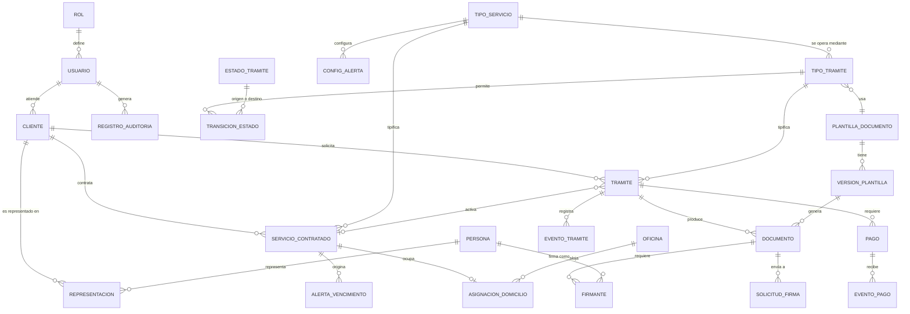

# Modelo de datos

| | |
|---|---|
| **Cliente** | Easy Office |
| **Proyecto** | CRM Easy Office · Plataforma de gestión y automatización documental |
| **Documento** | MOD-001 · Modelo de datos |
| **Versión** | 1.0 |
| **Fecha** | 24 de septiembre de 2026 |
| **Motor** | PostgreSQL (ver `REC-001` para la justificación) |
| **Estado** | Preliminar. Se ajusta al recibir el formulario Excel y el listado definitivo de campos que Easy Office comprometió en el §14 |
| **Preparado por** | Fernando Cartagena · Nicolás Zapata · Marcos Álvarez |

---

## 1. Alcance del modelo

Cubre las ocho áreas que define el encargo: usuarios y permisos, ficha del
cliente, servicios contratados con sus vencimientos, oficinas para el servicio
piloto, trámites configurables, documentos con sus plantillas y firmantes, pagos,
y auditoría.

Easy Office estima **alrededor de 30 campos por cliente** entre antecedentes,
contacto, servicios contratados y características de esos servicios (§4.1). El
modelo los distribuye entre `Cliente`, `Persona` y `ServicioContratado` en lugar
de concentrarlos en una sola tabla ancha, porque los datos de servicio son de
cardinalidad múltiple: un cliente puede tener varios servicios (§4.7).

---

## 2. Diagrama entidad-relación

---

## 3. Entidades

### 3.1 Usuarios y permisos

Responde al §4.2 del encargo, que define dos perfiles con facultades distintas y
recomienda un modelo por roles para poder crear perfiles nuevos sin reconstruir
el sistema.

| Entidad | Campos principales | Notas |
|---|---|---|
| `ROL` | `nombre`, `descripcion`, `permisos` | Perfiles iniciales: Dueño/Administrador y Ejecutivo. Nuevos roles se crean como datos, no como código |
| `USUARIO` | `email` (identificador de acceso), `nombres`, `apellidos`, `rol`, `activo`, `ultimo_acceso` | Acceso individual con usuario y contraseña (§4.3) |

**Regla derivada del §4.2:** el rol Ejecutivo no tiene la facultad de eliminar
registros de clientes. La restricción se expresa como permiso del rol, no como
condición en el código.

### 3.2 Clientes

| Entidad | Campos principales | Notas |
|---|---|---|
| `CLIENTE` | `folio` (identificador único, §4.5), `tipo` (natural / jurídica), `rut`, `nombre_razon_social`, `giro`, `email`, `telefono`, `direccion`, `comuna`, `region`, `ejecutivo_responsable`, `estado`, `observaciones` | Búsqueda indexada por RUT, razón social, teléfono, correo y folio (§4.5) |
| `PERSONA` | `rut`, `nombres`, `apellido_paterno`, `apellido_materno`, `email`, `telefono` | Personas naturales que intervienen: representantes legales y firmantes |
| `REPRESENTACION` | `cliente`, `persona`, `cargo`, `vigencia_desde`, `vigencia_hasta` | Un contrato lo firma el representante legal de la empresa, no "el cliente". La vigencia importa: no puede firmar quien ya no representa |

`CLIENTE` y `PERSONA` están separadas porque una misma persona puede ser
representante de varias empresas y firmante de documentos donde no es el cliente.

### 3.3 Servicios

Responde a los §4.6, §4.7 y §4.8.

| Entidad | Campos principales | Notas |
|---|---|---|
| `TIPO_SERVICIO` | `nombre`, `descripcion`, `precio_base`, `duracion_meses`, `es_automatizable`, `requiere_pago`, `requiere_firma`, `activo` | `es_automatizable` distingue los procesos automatizados de los asistidos |
| `SERVICIO_CONTRATADO` | `cliente`, `tipo_servicio`, `fecha_inicio`, `fecha_termino`, `estado`, `precio`, `ejecutivo_responsable`, `caracteristicas` (JSONB), `observaciones` | El precio se guarda en la contratación, no solo en el tipo: puede diferir del precio base y el dashboard pide ventas por servicio y por ejecutivo (§4.9) |
| `CONFIG_ALERTA` | `tipo_servicio`, `dias_anticipacion` | Anticipación configurable. Valores iniciales: 60, 30, 15 y 7 días (§4.8) |
| `ALERTA_VENCIMIENTO` | `servicio_contratado`, `dias_anticipacion`, `fecha_programada`, `estado`, `canal`, `enviada_en` | `canal` queda preparado para correo o mensajería, que el §4.8 menciona como extensión futura |

Las alertas se materializan como filas, no se calculan al vuelo, para que quede
registro de cuáles se generaron y cuáles se gestionaron.

### 3.4 Inmuebles

El servicio piloto es el domicilio tributario, cuyo contrato contiene la
ubicación de la oficina y su rol de avalúo.

| Entidad | Campos principales | Notas |
|---|---|---|
| `OFICINA` | `direccion`, `comuna`, `region`, `rol_avaluo`, `capacidad_domicilios`, `activa` | Easy Office opera oficinas en tres regiones |
| `ASIGNACION_DOMICILIO` | `oficina`, `servicio_contratado`, `vigencia_desde`, `vigencia_hasta` | Permite saber cuántas empresas están domiciliadas en una oficina y controlar el cupo |

`capacidad_domicilios` está `[PENDIENTE DE VALIDAR CON EASY OFFICE]`: no se
confirmó si existe un límite por oficina.

### 3.5 Trámites y motor configurable

Responde al §5.2 (formularios que se adaptan a distintos servicios sin desarrollo
nuevo) y al §8.2 (incorporar tipos de documentos de forma modular).

| Entidad | Campos principales | Notas |
|---|---|---|
| `TIPO_TRAMITE` | `nombre`, `tipo_servicio`, `plantilla`, `configuracion` (JSONB: campos, validaciones, orden), `requiere_pago`, `requiere_firma`, `activo`, `version` | El corazón del motor. Un tipo de trámite se define como dato |
| `ESTADO_TRAMITE` | `codigo`, `nombre`, `es_final` | Catálogo de estados |
| `TRANSICION_ESTADO` | `tipo_tramite`, `estado_origen`, `estado_destino`, `rol_autorizado`, `condicion` | La máquina de estados es una tabla, no condicionales repartidos por el código |
| `TRAMITE` | `folio`, `cliente`, `tipo_tramite`, `servicio_contratado`, `estado_actual`, `canal_origen` (portal / backoffice), `ejecutivo`, `datos` (JSONB), `creado_en` | `canal_origen` permite medir cuántos trámites se completan sin intervención de un ejecutivo |
| `EVENTO_TRAMITE` | `tramite`, `estado_anterior`, `estado_nuevo`, `usuario`, `fecha`, `observacion` | Línea de tiempo del trámite |

La `configuracion` en JSONB guarda la definición del formulario. PostgreSQL
permite indexar y consultar dentro de ese campo, de modo que no se pierde
capacidad de consulta al usarlo.

### 3.6 Documentos

| Entidad | Campos principales | Notas |
|---|---|---|
| `PLANTILLA_DOCUMENTO` | `nombre`, `tipo_documento`, `activa` | Easy Office ya tiene formatos definidos (§6) |
| `VERSION_PLANTILLA` | `plantilla`, `numero_version`, `archivo`, `campos_requeridos` (JSONB), `vigente_desde`, `creada_por` | Inmutable una vez emitido un documento con ella |
| `DOCUMENTO` | `tramite`, `version_plantilla`, `archivo_generado`, `hash_generado`, `archivo_firmado`, `hash_firmado`, `datos_snapshot` (JSONB), `estado`, `generado_en` | Un trámite puede producir más de un documento: por ejemplo contrato y autorización, o una regeneración tras corregir datos. Ver decisiones 1 a 3 |
| `FIRMANTE` | `documento`, `persona`, `rol_firmante`, `orden`, `estado`, `firmado_en` | Un documento puede requerir más de una firma |
| `SOLICITUD_FIRMA` | `documento`, `proveedor`, `id_externo`, `estado`, `enviada_en`, `respuesta` (JSONB) | `id_externo` único para idempotencia |

### 3.7 Pagos

| Entidad | Campos principales | Notas |
|---|---|---|
| `PAGO` | `tramite`, `monto`, `proveedor`, `id_externo` (único), `estado`, `fecha`, `respuesta` (JSONB), `secuencia` | Un trámite puede tener más de un pago: intentos fallidos que quedan registrados, y la modalidad 50/50 que Easy Office usa hoy. `secuencia` distingue el primer pago del segundo. El §5.3 exige verificar el resultado antes de continuar |
| `EVENTO_PAGO` | `pago`, `tipo_evento`, `payload` (JSONB), `recibido_en` | Las notificaciones de las pasarelas llegan duplicadas y fuera de orden |

### 3.8 Auditoría

Responde literalmente al §4.3, que enumera los campos que debe registrar cada
modificación importante.

| Entidad | Campos principales |
|---|---|
| `REGISTRO_AUDITORIA` | `usuario`, `accion`, `entidad`, `registro_id`, `valor_anterior` (JSONB), `valor_nuevo` (JSONB), `fecha_hora`, `direccion_ip` |

El encargo exige que el historial esté protegido para impedir que usuarios
normales lo alteren o eliminen. Se implementa como tabla **append-only**: sin
operaciones de actualización ni borrado, y con la escritura mediante disparadores
de base de datos en lugar de señales de la aplicación, porque un disparador es
más difícil de eludir y más fácil de demostrar ante una auditoría.

---

## 4. Decisiones de diseño

**1 · Plantillas versionadas.** Cada documento emitido apunta a la versión exacta
de plantilla con que se generó. Si Easy Office corrige una cláusula, los
documentos emitidos antes no cambian. Sin esto, un contrato firmado en marzo
podría "reescribirse" al editar la plantilla en mayo.

**2 · Copia congelada de los datos.** `DOCUMENTO.datos_snapshot` guarda los datos
usados al generar. Si el cliente actualiza su dirección después, el contrato
firmado conserva la que tenía al firmar. Es la diferencia entre un sistema
documental y un generador de plantillas.

**3 · Hash de integridad.** Se calcula y almacena por separado para el archivo
generado y para el archivo firmado.

Importante: **los dos hashes son necesariamente distintos**. La firma electrónica
se incorpora dentro del PDF, que admite actualizaciones incrementales, de modo
que el archivo firmado no es byte a byte igual al generado. Comparar ambos hashes
esperando igualdad sería un control que falla siempre.

Lo que cada hash permite verificar:

- `hash_generado` prueba qué archivo exacto se envió al proveedor de firma, y
  permite detectar cualquier alteración del documento entre su generación y su
  envío.
- `hash_firmado` prueba qué archivo exacto se recibió de vuelta, y permite
  detectar alteraciones posteriores al archivo almacenado.
- La correspondencia entre ambos se establece por el identificador de la
  solicitud de firma (`SOLICITUD_FIRMA.id_externo`), no por comparación de
  hashes, y se complementa con la validación de la firma del documento recibido.

**4 · Máquina de estados como datos.** Las transiciones válidas viven en
`TRANSICION_ESTADO`, con el rol autorizado para cada una. Agregar un estado a un
servicio nuevo no requiere tocar código.

**5 · Idempotencia en operaciones externas.** `PAGO` y `SOLICITUD_FIRMA` llevan
identificador externo único y registran cada evento recibido.

**6 · JSONB donde la forma es variable.** `TIPO_TRAMITE.configuracion`,
`TRAMITE.datos`, `SERVICIO_CONTRATADO.caracteristicas` y los valores de auditoría.
El resto es relacional estricto, con claves foráneas e integridad referencial.

**7 · Trámite y servicio contratado son distintos.** El trámite es la operación,
con su flujo y sus estados; el servicio contratado es lo que el cliente tiene
vigente, con su fecha de vencimiento. Un trámite de renovación crea un servicio
contratado nuevo sin borrar el anterior, lo que preserva el historial que pide
el §4.6.

---

## 5. Índices previstos

Derivados de los criterios de búsqueda del §4.5 y de los indicadores del §4.9.

| Tabla | Índice | Motivo |
|---|---|---|
| `CLIENTE` | `rut` (único), `folio` (único) | Identificación |
| `CLIENTE` | `nombre_razon_social`, `email`, `telefono` | Búsqueda declarada |
| `CLIENTE` | `ejecutivo_responsable`, `estado` | Filtros del listado |
| `SERVICIO_CONTRATADO` | `fecha_termino`, `estado` | Detección de vencimientos |
| `SERVICIO_CONTRATADO` | `tipo_servicio`, `ejecutivo_responsable` | Ventas por servicio y por ejecutivo |
| `TRAMITE` | `folio` (único), `estado_actual`, `creado_en` | Listados y dashboard |
| `REGISTRO_AUDITORIA` | `entidad` + `registro_id`, `fecha_hora` | Consulta del historial de un registro |

---

## 6. Migración desde Excel

Easy Office entregará el formulario actual de Excel con macros como referencia
funcional y el listado definitivo de campos (§14). El proceso previsto:

1. **Perfilado.** Inventario de columnas, tipos reales, valores nulos, duplicados
   y formatos inconsistentes.
2. **Mapeo.** Tabla de correspondencia entre cada columna y su campo destino, con
   las transformaciones necesarias.
3. **Carga en etapas.** Tabla de staging sin restricciones, validación, y recién
   entonces carga a las tablas definitivas.
4. **Cuarentena.** Los registros que no pasan validación no se cargan a medias:
   quedan apartados con el motivo.
5. **Reporte.** Salida con registros cargados, en cuarentena y el motivo de cada
   rechazo, para que Easy Office corrija en origen.
6. **Repetible.** El proceso puede ejecutarse varias veces sin duplicar registros.

La planilla contiene datos personales reales. Se anonimiza antes de entrar a
cualquier entorno de desarrollo y ningún dato real se versiona en el repositorio,
que es público.

---

## 7. Pendientes de validación

| # | Pendiente | Impacto |
|---|---|---|
| MD-01 | Listado definitivo de los 30 campos del cliente | Puede agregar o reubicar atributos |
| MD-02 | Listado de servicios y sus características | Define `TIPO_SERVICIO` y el contenido de `caracteristicas` |
| MD-03 | Estados del trámite y transiciones válidas | Puebla `ESTADO_TRAMITE` y `TRANSICION_ESTADO` |
| MD-04 | Si existe límite de empresas domiciliadas por oficina | Define `capacidad_domicilios` |
| MD-05 | Formato de las plantillas de contrato | Determina qué guarda `VERSION_PLANTILLA.archivo` |
| MD-06 | Si los precios son fijos por servicio o varían por cliente | Ya está previsto guardarlos en la contratación |
| MD-07 | Campos variables de cada documento a automatizar | Define `campos_requeridos` por versión de plantilla |
